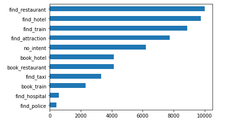
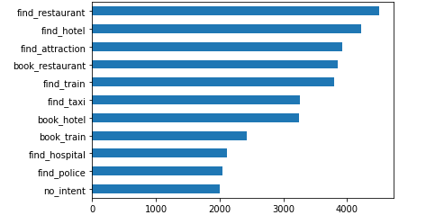
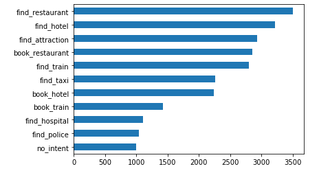

# LaBSE and BERT models on the MultiWOZ
I have compared the performance of LaBSE and BERT models on classifiying the intents of the MultiWOZ dataset by fine tuning the models using English text/dialogues. Then I have also translated the English text to Russian and evaluated both models on it without tuning the models onto the Russian Language. 

**MultiWOZ Dataset:** Multi-Domain Wizard-of-Oz dataset (MultiWOZ) is a fully-labeled collection of human-human written conversations spanning over multiple domains and topics.

## Preparing the data:

I have created 3 CSV files using the following steps:-

1. I have started by extracting text/dialogue and intents from JSON files of train and test folders of the MultiWOZ 2.1 dataset. I got 51244 instances for training and 6843  for testing.
2. The dataset contains the following intents:- book_hotel, book_restaurant, book_train, find_attraction, find_bus, find_hospital, find_hotel, find_police, find_restaurant, find_taxi, find_train
3. Some entries had more than 2 intents. I removed them and got  50838 text/dialogue with intents for training and 6802 text/dialogue with intents for testing. 
4. Then I One -Hot encoded the intents using sklearn.preprocessing.MultiLabelBinarizer 
5. I added no_intents where text/dialogue didn’t have any intent. See the code- [Extract Intents.ipynb](https://github.com/shoaib6174/MultiWOZ-Intent-Classification/blob/main/Extract%20Intents.ipynb)
6. I translated the texts of the test dataset to Russian for evaluation using googletrans. See the code- [translate_to_russian.ipynb](https://github.com/shoaib6174/MultiWOZ-Intent-Classification/blob/main/translate_to_russian.ipynb)
7. So, finally, I got the following 3 CSV files-
    1. Train_intent.csv
    2. Test_intents.csv
    3. Russian_intents_test.csv

The intents distribution in the training dataset-

To get a balanced dataset, I have made a subset of the training data by sampling intents each for all the single entries using the Sampling with replacement method and then combined it with all the multi-intent dialogues. For the Bert model, I have sampled 2000 intents for each of the single intent entries but for LaBSE, due to resources constraint I had to sample 1000 intents. 

The intents distribution for the Bert Model-

The intents distribution for the LaBSEMode-

Then I have split the training data into train_df and val_df.

Finally, I have built a data module using **<code>LightningDataModule</code></strong> class of PyTorch-Lightning. I used <code>AutoTokenizer</code>/<code>BertTokenizer </code>to tokenize the data.
  
  
## Models:

I have built IntentClassifier models using Bert and LaBSE models from the transformers library which was developed by Hugging Face. I have used AdamW as an optimizer.
See the codes-
[BERT on MultiWOZ.ipynb](https://github.com/shoaib6174/MultiWOZ-Intent-Classification/blob/main/BERT%20on%20MultiWOZ.ipynb)
[LaBSE on MultiWOZ.ipynb](https://github.com/shoaib6174/MultiWOZ-Intent-Classification/blob/main/LaBSE%20on%20MultiWOZ.ipynb)
Due to resource constraints, I had to use a smaller data set for training. 

<table>
  <tr>
   <td>
   </td>
   <td><strong>BERT</strong>
   </td>
   <td><strong>LaBSE</strong>
   </td>
  </tr>
  <tr>
   <td><strong>Model Name</strong>
   </td>
   <td>bert-base-cased
   </td>
   <td>sentence-transformers/LaBSE
   </td>
  </tr>
  <tr>
   <td><strong>Size of Training Data</strong>
   </td>
   <td>27255
   </td>
   <td>16805
   </td>
  </tr>
  <tr>
   <td><strong>Size of Validation Data</strong>
   </td>
   <td>1435
   </td>
   <td>885
   </td>
  </tr>
  <tr>
   <td><strong>Number of Epochs</strong>
   </td>
   <td>3
   </td>
   <td>6
   </td>
  </tr>
  <tr>
   <td><strong>Number of Parameters</strong>
   </td>
   <td>108 M
   </td>
   <td>470 M
   </td>
  </tr>
  <tr>
   <td><strong>Batch Size</strong>
   </td>
   <td>12
   </td>
   <td>24
   </td>
  </tr>
  <tr>
   <td><strong>Max Token Count</strong>
   </td>
   <td>128
   </td>
   <td>128
   </td>
  </tr>
  <tr>
   <td><strong>Threshold</strong>
   </td>
   <td>0.5
   </td>
   <td>0.5
   </td>
  </tr>
</table>

  
 ## Model Comparison:

<table>
  <tr>
   <td colspan="2" >→ Model Name →
   </td>
   <td colspan="2" ><strong>BERT</strong>
   </td>
   <td colspan="2" ><strong>LaBSE</strong>
   </td>
  </tr>
  <tr>
   <td>↓ Metric ↓
   </td>
   <td>→ Language →

↓ Method ↓
   </td>
   <td>English (Original)
   </td>
   <td>Russian (Translated)
   </td>
   <td>English (Original)
   </td>
   <td>Russian (Translated)
   </td>
  </tr>
  <tr>
   <td><strong>Accuracy</strong>
   </td>
   <td>-
   </td>
   <td>0.9695
   </td>
   <td>0.8777
   </td>
   <td>0.9585
   </td>
   <td>0.9569
   </td>
  </tr>
  <tr>
   <td rowspan="4" ><strong>Precision</strong>
   </td>
   <td>Sample Average
   </td>
   <td>0.86
   </td>
   <td>0.05
   </td>
   <td>0.81
   </td>
   <td>0.78
   </td>
  </tr>
  <tr>
   <td>Weighted Average
   </td>
   <td>0.88
   </td>
   <td>0.70
   </td>
   <td>0.78
   </td>
   <td>0.82
   </td>
  </tr>
  <tr>
   <td>Micro Average
   </td>
   <td>0.88
   </td>
   <td>0.18
   </td>
   <td>0.77
   </td>
   <td>0.81
   </td>
  </tr>
  <tr>
   <td>Macro Average
   </td>
   <td>0.83
   </td>
   <td>0.53
   </td>
   <td>0.73
   </td>
   <td>0.74
   </td>
  </tr>
  <tr>
   <td rowspan="4" ><strong>Recall</strong>
   </td>
   <td>Sample Average
   </td>
   <td>0.84
   </td>
   <td>0.05
   </td>
   <td>0.86
   </td>
   <td>0.78
   </td>
  </tr>
  <tr>
   <td>Weighted Average
   </td>
   <td>0.81
   </td>
   <td>0.05
   </td>
   <td>0.84
   </td>
   <td>0.75
   </td>
  </tr>
  <tr>
   <td>Micro Average
   </td>
   <td>0.81
   </td>
   <td>0.05
   </td>
   <td>0.84
   </td>
   <td>0.75
   </td>
  </tr>
  <tr>
   <td>Macro Average
   </td>
   <td>0.82
   </td>
   <td>0.07
   </td>
   <td>0.84
   </td>
   <td>0.75
   </td>
  </tr>
  <tr>
   <td rowspan="4" ><strong>F1 Score</strong>
   </td>
   <td>Sample Average
   </td>
   <td>0.84
   </td>
   <td>0.05
   </td>
   <td>0.82
   </td>
   <td>0.76
   </td>
  </tr>
  <tr>
   <td>Weighted Average
   </td>
   <td>0.84
   </td>
   <td>0.06
   </td>
   <td>0.81
   </td>
   <td>0.78
   </td>
  </tr>
  <tr>
   <td>Micro Average
   </td>
   <td>0.82
   </td>
   <td>0.08
   </td>
   <td>0.81
   </td>
   <td>0.78
   </td>
  </tr>
  <tr>
   <td>Macro Average
   </td>
   <td>0.85
   </td>
   <td>0.06
   </td>
   <td>0.75
   </td>
   <td>0.74
   </td>
  </tr>
</table>

Here, we can see that the BERT model has performed well on English texts but it has done really poorly on Russian Texts and the LaBSE model has done well on both English and Russian texts. BERT model has done better on English text than LaBSE because we trained LaBSE with fewer data. 

It’s possible to get better results on this dataset than this with more computation power. I also couldn’t optimize the hyperparameters due to resource constraints. 
